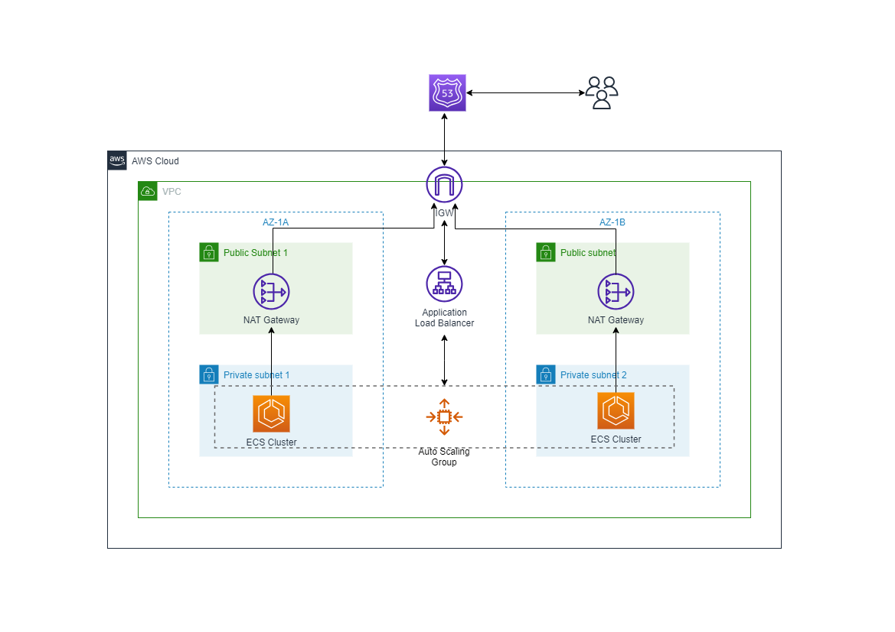

# Terraform ECS & CI/CD Project

This repository contains code used to create aws infrastructure following the architecture diagram below. 👇
 
 

## What will be created
1) VPC
1) NAT Gateway
1) Security Groups
1) Application Load Balancer
1) ECS Cluster (EC2 based)
1) ECS task
1) Route 53 record